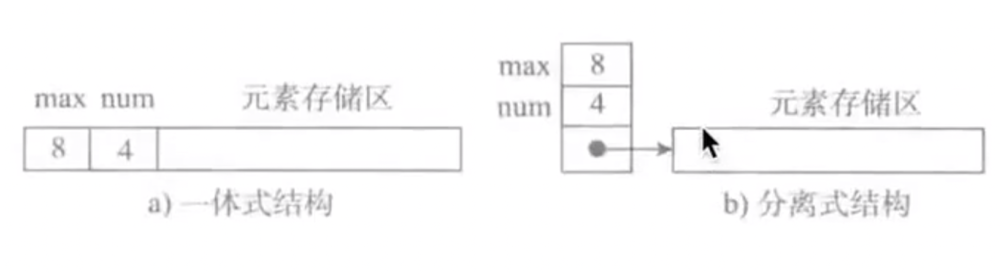

## 概念
**数据**是一个抽象的概念，将其进行分类后得到程序设计语言中的基本类型。如：int，float，cahr等。数据元素之间不是独立的，存在特定的关系，这些关系便是结构。数据结构指数据对象中的数据元素之间的关系。

Python给我们提供了很多现成的数据结构类型，这些系统自己定义好的，不需要我们自己去定义的数据结构叫做Python的内置数据结构，比如列表、元组、字典。而有些数据组织方式，Python系统里面没有直接定义，需要我们自己去定义实现这些数据的组织方式，这些数据组织方式称之为Python的拓展数据结构，比如堆栈、队列等。

## 算法与数据结构的区别
数据结构只是静态的描述了数据元素之间的关系。

高效的程序需要在数据结构的基础上设计和选择算法。

**程序 = 数据结构 + 算法**

**总结：算法是为了解决实际问题而设计的，数据结构是算法需要处理的问题载体**
## 抽象数据类型（Abstract Data Type）
抽象数据类型的含义是指一个数学模型以及定义在此数学模型上的一组操作。即把数据类型和数据类型上的运算捆绑在一起，进行封装。引入抽象数据类型的目的是吧数据类型的表示和数据类型和运算在程序中的引用隔开，使它们相互独立。

最常用的数据运算有五种：
- 插入
- 删除
- 修改
- 查找
- 排序

## 顺序表
在程序中，经常需要将一组（通常是同为某个类型的）数据元素作为整体管理和使用，需要创建这种元素组，用变量记录它们，传进传出函数等。一组数据中包含的元素个数可能发生变化（可以增加或删除元素）。

对于这种需求，最简单的解决方案便是将这样一组元素看成一个序列，用元素在序列的位置和顺序，表示实际应用中的某种有意义的信息，或者表示数据之间的某种关系。

这样的一组序列元素的组织形式，我们可以将其抽象为**线性表**。一个线性表是某类元素的一个集合，还记录着元素之间的一种顺序关系。线性表是最基本的数据结构之一，在实际程序中应用非常广泛，它还经常被用作更复杂的数据结构的实现基础。

根据线性表的实际存储方式，分为两种实现模型：
- **顺序表**：将元素顺序地存放在一块连续的存储区里，元素间的顺序关系由它们的存储顺序自然表示。
- **链表**：将元素存放在通过链接构造起来一系列存储块中。

#### 现在我们打个比方，如果：我们需要存储一个连续的数据结构，如果全部都是数字，如果存入的不只是数字还有字符，应该怎么存储？
1. 第一种，假设我们存入的都是整型数字，一个数字占4个字节，那么让它的地址是连续的，进而，我们的Li存入的就是0x23，那么列表得的下标存入的就是以这个地址的偏移量。0乘以4个字节的加上Li存入的地址，就是该顺序表的第一个元素，以此类推。
2. 第二种，与第一种情况不相似，我们知道，存入整型变量是四个字节，那么存入Char类型，却是一个字节，我们让Li存入该顺序表开始的地址0x23，然后按下标计算偏移量去获取顺序表的元素，显然不可取，因为我们不知道怎么取偏移量（乘以4个字节还是1个字节呢？），那么我们发现，地址是连续的且始终占四个字节，我们可以通过存储连续的地址，然后让每个地址指向不同的数据类型，假设我们下图中，Li存入了存储连续地址的顺序表的地址开头0x324，而存储的地址又指向了不同的数据类型，我们就可以通过下标计算地址偏移量，获取存储的地址来指向我们存储的变量。

### 顺序表的两种基本实现方式

图a为一体式结构，存储表信息的单元与元素与元素存储区一连续的方式安排在一块存储区里，两部分数据的整体形成一个完整的顺序表对象。

一体式结构整体性强，易于管理。但是由于数据元素存储区域是表对象的一部分，顺序表创建后，元素存储区就固定了。

图b为分离式结构，表对象里只保存与整个表有关的信息（即容量和元素个数），实际数据元素存放在另一个独立的元素存储区里，通过链接与基本表对象关联。

### 存储区的替换
一体式结构由于顺序表信息区与数据区连续存储在一起，所以若想更换数据区，则只能整体搬迁，即整个顺序表对象（指存储顺序表的结构信息的区域）改变了。

分离式结构若想更换数据区，只需要将信息表中的数据区链接地址更新即可，而该顺序表对象不变。

### 元素存储区扩充
采用分离式结构的顺序表，若将数据区更换为存储空间更大的区域，则可以在不改变表对象的前提下对其数据存储区进行了扩充，所有使用这个表的地方都不必修改，只要程序的运行环境（计算机系统）还有空闲存储，这种表结构就不会因为满了而导致操作无法进行。人们把采用这种技术实现的顺序表成为动态顺序表，因为其容量可以在使用中动态变化。

#### 扩充的两种策略
- 每次扩充增加固定数据的存储位置，如每次扩充增加10个元素位置，这种策略可称为线性增长。**特点**：节省空间，但是扩充操作频繁，操作次数多。
- 每次扩充容量加倍，如每次扩充增加一倍存储空间。**特点**：减少了扩充操作的执行次数，但可能会浪费空间资源。以空间换时间，推荐的方式。